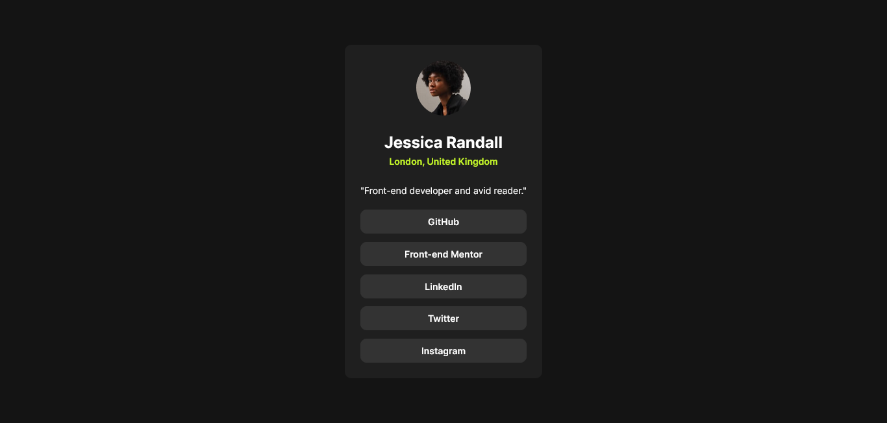

# Frontend Mentor - Social links profile solution

This is a solution to the [Social links profile challenge on Frontend Mentor](https://www.frontendmentor.io/challenges/social-links-profile-UG32l9m6dQ). Frontend Mentor challenges help you improve your coding skills by building realistic projects.

## Table of contents

-   [Overview](#overview)
    -   [The challenge](#the-challenge)
    -   [Screenshot](#screenshot)
    -   [Links](#links)
-   [My process](#my-process)
    -   [Built with](#built-with)
    -   [What I learned](#what-i-learned)
    -   [Continued development](#continued-development)
-   [Author](#author)
-   [Acknowledgments](#acknowledgments)

**Note: Delete this note and update the table of contents based on what sections you keep.**

## Overview

### The challenge

Users should be able to:

-   See hover and focus states for all interactive elements on the page

### Screenshot

### Links

-   Solution URL: [Add solution URL here](https://your-solution-url.com)
-   Live Site URL: [Add live site URL here](https://your-live-site-url.com)

## My process

### Built with

-   Semantic HTML5 markup
-   CSS custom properties
-   Flexbox
-   Mobile-first workflow

### What I learned

-Making use of relative units for almost every element in the page  
-Mobile-first workflow
-Having a proper reset-css rules in my css file

### Continued development

For the upcoming projects, I'd like to explore a little more and try to find a better way to make the website responsive, maybe making use of some css functions

## Author

-   Frontend Mentor - [@Joliot-TSIMISARAKA](https://www.frontendmentor.io/profile/Joliot-TSIMISARAKA)
-   Twitter - [@JoliotSitraka](https://x.com/JoliotSitraka)

## Acknowledgments

Although not specifically in this particular project, @grace-snow really helped me a lot, by pinpointing all my mistakes and bad practices from previous projects. Along with accurate advices from her part, it becomes more natural to have a feel for responsive design.
